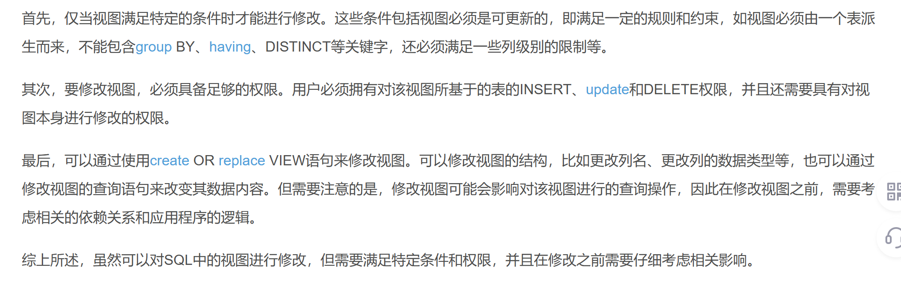
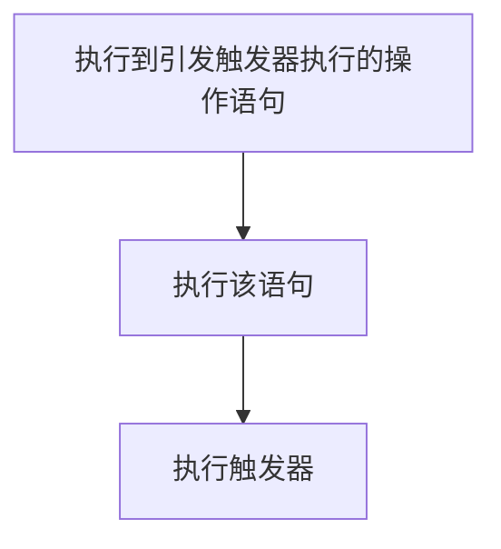
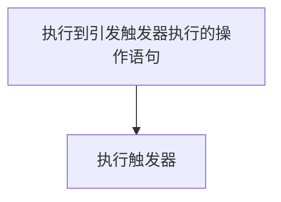

## 第六章--索引和视图

### 索引

索引使对数据的查找不需要对整个表进行扫描，就可以找到所需的数据。但索引是有代价的，会占用内存，还需要进行维护

#### 索引的存储类型

聚集索引：对数据按索引关键字值进行物理排序

非聚集索引：不对数据物理排序，而是将索引关键字按值进行排序

详细看这个文章：

[MySQL的索引——索引的介绍及其数据结构B+树 & 索引的类型 & 索引的使用及其失效场景 & 相关名词解释_mysql的索引结构-CSDN博客](https://blog.csdn.net/Pireley/article/details/133931413)

#### 创建和删除索引

``` sql
CREATE [UNIQUE] [CLUSTERED|NONCLUSTERED]
	INDEX <索引名> ON <表名> (列名[,...n])
```

- UNIQUE：表示要创建的索引是唯一索引
- CLUSTERED：聚集索引
- NONCLUSTERED：非聚集索引

``` sql
DROP INDEX <表名>.<索引名>
```

### 视图

从数据库中的基本表中提取出来的数据组成逻辑窗口，是基本表的部分行和列的组合

好处：

- 视图数据始终与基本表的数据保持一致
- 节省存储空间

定义视图

``` sql
CREAT VIEW <视图名> [(列名[,...n])]
AS 
	SELECT 语句
```

- SELECT语句一般不包含ORDER BY和DISTINCT子句
- 定义视图时要么指定视图全部列名，要不就不写，以下三种情况必须明确所有列名
  - 某个目标列是函数或表达式，并且在SELECT中没有为这时的列取别名
  - 多表连接时出现了多个列同名
  - 需要视图为某个列选用其他更合适的列名

#### 定义单元表视图

``` sql
CREATE VIEW IS_Student
AS 
	SELECT Sno,Sname,Ssex,Sage
		FROM Student WHERE Sdept='信息管理系'
```

#### 定义多源表视图

``` sql
CREATE VIEW V_IS_S1(Sno,Sname,Grade)
AS 
	SELECT Student.Sno,Sname,Grade
		FROM Student JOIN SC ON Student.Sno=SC.Sno
		WHERE Sdept='信息管理系' AND SC.Cno='C001'
```

#### 在原有视图里定义新视图

``` sql
CREATE VIEW V_IS_S2(Sno,Sname,Grade)
AS 
	SELECT Student.Sno,Sname,Grade
		FROM IS_Student JOIN SC ON IS_Student.Sno=SC.Sno
		WHERE Sdept='信息管理系' AND SC.Cno='C001'
```

#### 定义带表达式的视图

有时候根据需要需要一些派生属性，而这些表在基本表中不存在，因此称为虚拟列

``` sql
CREATE VIEW BT_S(Sno,Sname,BirthYear)
AS 
	SELECT Student.Sno,Sname,2024-Sage
		FROM Student 
```

#### 含分组统计信息的视图

指定义视图的查询语句中含有GROUP BY子句，这样的视图只能用于查询，不能修改

``` sql
CREATE VIEW S_G
AS
SELECT Sno,AVG(Grade) AverageGrade FROM SC
	GROUP BY Sno
```

### 通过视图查询数据

定义好数据之后就可以通过视图操作了，操作的语法与操作表一样

聚合函数不能出现在WHERE子句中

能否通过视图修改数据的基本原则是：**如果这个操作能落实到表上，就可以通过视图操作数据**



### 修改和删除视图

修改

``` sql
ALTER VIEW <视图名> [(列名[,...n])]
AS 
	SELECT 语句
```

删除视图

``` sql
DROP VIEW <视图名>
```

### 视图的作用

- 简化数据查询语句
- 使用户能从多角度看待同一数据
- 提高数据的安全性
- 提供一定程度的逻辑独立性，对应的是外模式

### 物化视图

## 第七章--触发器和存储过程

### 触发器

是一段对由对数据的更改操作引发的自动执行的代码，这些操作包含UPDATE、INSERT、DELETE

创建触发器

``` sql
CREATE TRIGGER 触发器名称
ON {表名|视图名}
{FOR |ALTER|INSTEAD OF}
{[INSERT][,][DELETE][,][UPDATE]}
AS
	SQL语句
```

- 触发器在数据库中必须是唯一的
- ON子句用于指定执行触发器的表
- ALTER指定的触发器只有在引发的SQL语句中的操作都已成功执行，且所有的约束检查也成功完成才执行此触发器
- FOR同ALTER
- INSTEAD OF指定执行触发器，从而代替触发语句操作

注意：

- 在一个表上可以建立多个名称不同、类型各异 的触发器，每个触发器都可由三个操作来引发
- 对于ALTER，可以在同一种操作上建立多个触发器，而INSTEAD OF在同一种操作则只能创建1个
- 所有创建和更改数据库以及数据对象的语句、所有DROP语句均不能在触发器使用
- 在触发器可以使用两个临时表：INSERTED表和DELETED表，这两个表由系统自动创建，且只能用在触发器代码中
  - INSTERTED保存了INSERT操作中新插入的数据和UPDATE操作中更新的数据
  - DELETED保存了DELETE操作中删除的数据和UPDATE操作更新前的数据

#### 后触发型触发器

使用FOR或AFTER选项定义的触发器为后触发型触发器，只有在引发触发器执行语句都已成功执行，才执行触发器

注意：不能在视图上定义AFTER触发器



例2：针对SC表编写后触发型触发器：限制每个学生总的选课门数不能超过10门

``` sql
CREATE Trigger tri_total_AFT
	ON SC AFTER INSERT
AS
	IF (SELECT COUNT(*) FROM SC
       WHERE Sno IN (SELECT Sno FROM INSERTED)
       )>10
      ROLLBACK
```

还得多练

#### 前触发型触发器

用INSTEAD OF 选项定义的触发器为前触发型触发器。这种模式下的触发器中，指定执行触发器而不是执行触发器执行的SQL语句，从而替代引发语句的操作



例2：限制每个学生总的选课门数不能超过10门

``` sql
CREATE Trigger tri_total_INS
	ON SC INSTEAD OF INSERT
AS
	IF (SELECT COUNT(*) FROM SC
       WHERE Sno IN (SELECT Sno FROM INSERTED)
       )<10
      INSERT INTO SC SELECT * FROM INSERTED
```

#### 删除触发器

``` sql
DROP TRIGGER 触发器
```

### 存储过程

T-SQL用来将SQL语句存储到数据库服务器端，客户端应用程序就可以直接调用并执行存储过程，并处理返回其结果

好处：

- 允许模块化程序设计
- 改善性能
- 减少网络流量
- 可作为安全机制使用

#### 创建和执行存储过程

创建存储过程的SQL语句为：`CREATE PROCEDURE`

``` sql
CREATE PROC [EDURE] 存储过程名
[{@参数名 数据类型}[= default][OUTPUT]][,...n]
AS 
	SQL 语句[...n]
```

执行存储过程的SQL语句是EXECUTE

``` sql
[EXEC[UTE]] 存储过程名
	[实参[,OUTPUT][,...n]]
```

带有多个参数的存储过程，参数的传递方式有两种：

1. 按参数位置传参
2. 按参数名传参

T-SQL的变量声明方法

``` sql
Declare @变量名 数据类型
```

变量前加@以表示为用户声明的变量

T-SQL输出语句

```
PRINT 'ASCII文本字符串'|@局部变量名|字符串表达式|@@函数名|
```

