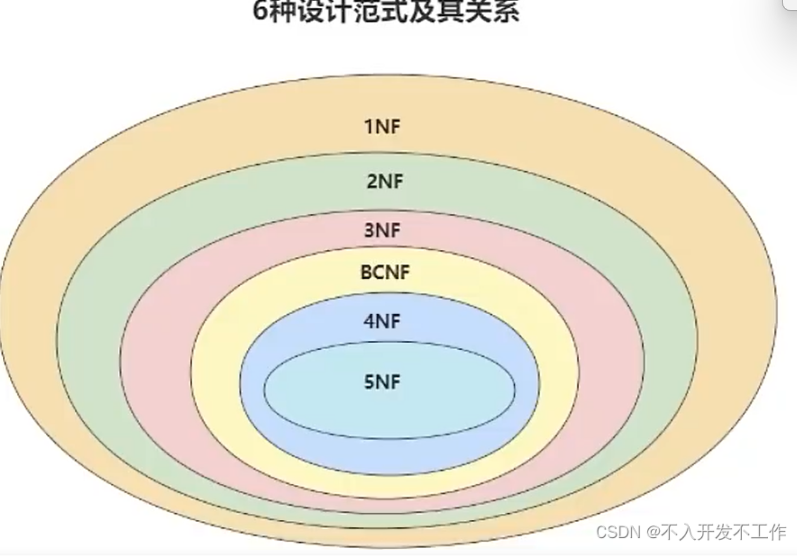
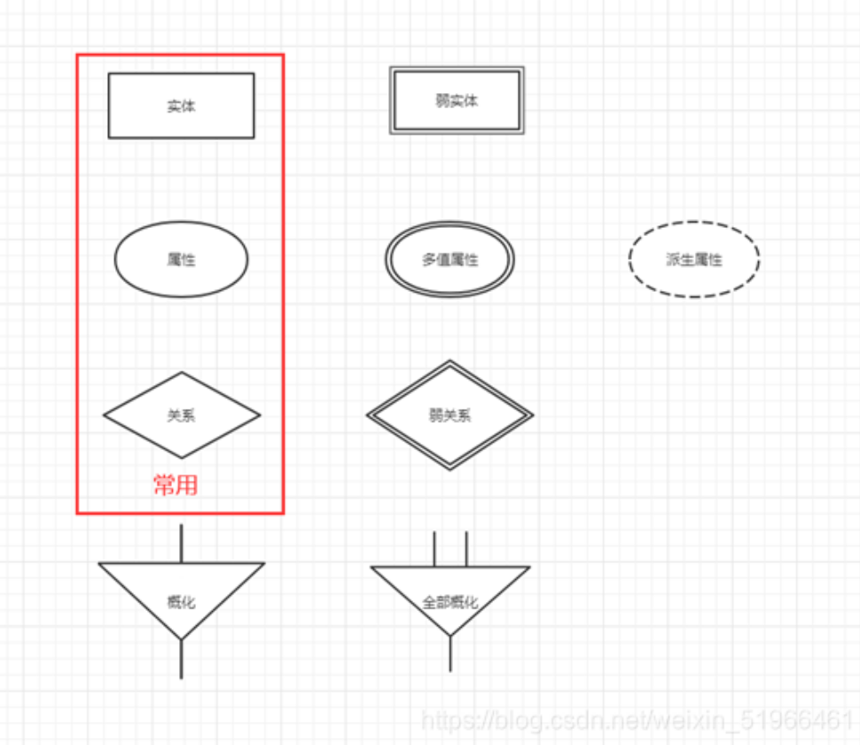
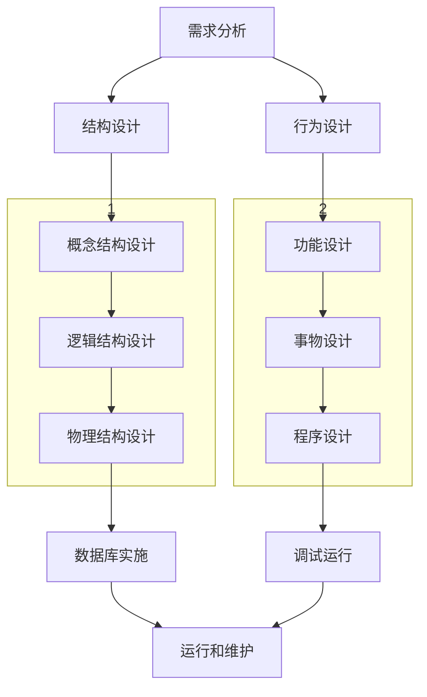

## 第八章--关系规范化理论

关系规范化是数据库设计的一个**理论指南**

### 函数依赖

设有关系模式$R(A_1,A_2,...,A_n)$，$X$和$Y$ 均为$\{A_1,A_2,...,A_n\}$的子集，$r$是$R$的任一具体关系，$t_1,t_2$是$r$中的任意两个元组。如果$t_1[X]=t_2[X]$可也推导出$t_1[Y]=t_2[Y]$，就称$X$函数决定$Y$，或$Y$函数依赖于$X$，记为$X\rightarrow Y$

只要$t_1[X]=t_2[X]\Rightarrow t_1[Y]=t_2[Y]成立，就有X\rightarrow Y$

例：设有关系模式S(Sno,Sname,Sdept,Dept_master)，主键为Sno,则有如下函数依赖关系

$Sno \overset{f} \rightarrow Sname$

$\because Sno \overset{f} \rightarrow Sdept $

$Sdept \overset{f} \rightarrow Dept\_master$

$\therefore Sno \overset{p} \rightarrow Sdept$

#### 函数依赖的推理关系

设有关系模式$R(U,F),U$为关系模式$R$上的属性级，$F$为$R$上成立的只涉及$U$中属性的函数依赖集，$X,Y,Z,W$均是$U$的子集，函数依赖的推理规则如下:($XY表示X\bigcap Y $)

##### 自反律

$若Y\subseteq X\subseteq U，则X\rightarrow Y成立，即一组属性决定他的所有子集 $

##### 增广律

$若X\rightarrow Y在R上成立，且Z\subseteq U，则XZ\rightarrow YZ在R上也成立 $

##### 传递律

$若X\rightarrow Y和Y\rightarrow Z在R上成立，则X\rightarrow Z在R上也成立 $

##### 合并规则

$若X\rightarrow Y和Y\rightarrow Z在R上成立，则X\rightarrow YZ在R上也成立 $

##### 分解规则

$若X\rightarrow Y和Z\subseteq Y在R上成立，则X\rightarrow Z在R上也成立 $

##### 伪传递规则

$若X\rightarrow Y和YW\rightarrow Z在R上成立，则XW\rightarrow Z在R上也成立 $

##### 复合规则

$若X\rightarrow Y和W\rightarrow Z在R上成立，则XW\rightarrow YZ在R上也成立 $

#### 闭包

[数据库中闭包，候选键的概念及候选键的求解方法_数据库闭包符号-CSDN博客](https://blog.csdn.net/weixin_43211195/article/details/104322188)

R类：①只在右边出现的属性，不属于候选码;
L类：②只在左边出现的属性，一定存在于某候选码当中;
N类：③左右都不出现的属性一定存在于任何候选码当中;
LR类：④其他属性逐个与2,3的属性组合，求属性闭包，若闭包等于U,则为候选码。

这就是离散数学

#### 为什么讨论函数依赖

为了避免这些问题：

- 数据冗余问题
- 数据更新问题
- 数据插入问题
- 数据删除问题

### 范式



关系桑数据库的关系要满足一定的要求，满足不同程度的要求即为不同的范式。这些范式是递进的，第一范式的关系模式就是比不是第一范式的关系模式好；第二范式就是比第一范式好...

#### 第一范式（1NF）

不包含非原子项属性的关系是第一范式的关系(**1NF**)

规范为1NF的表：

|    系名    | 教授人数 | 副教授人数 |
| :--------: | :------: | :--------: |
|  计算机系  |    6     |     20     |
| 通信管理系 |    4     |     3      |
| 通信工程系 |    3     |     5      |

#### 第二范式(2NF)

定义：如果$R(U,F)\in 1NF$，并且$R$中的每个非主属性都完全函数依赖于主键，则$R(U,F)\in 2NF$

若某个第一范式关系的主键的主键只由一个列组成，那这个关系就是第二范式关系

例：S-L-C(Sno,Sname,Ssex,Sdept,Sloc,Cno,Grade)不是第二范式

因为主键是（Sno,Cno），且有$Sno\rightarrow Sname$，所以存在：

$(Sno,Cno)\overset{p}\rightarrow Sname$

**怎么变成2NF呢?**

1. 得对这个进行分解为以下3个关系模式：

   S-L(<u>Sno</u>，...)

   C(<u>Cno</u>，....)

   S-C(<u>Sno,Cno</u>，...)

2. 将依赖于这些主键属性的放到相应的关系模式：

   S-L(Sno,Sname,Ssex,Sdept,Sloc)

   C(Cno)

   S-C(Sno,Cno,Grade)

3. 去掉只由主键的子集构成的关系模式：

   S-L(Sno,Sname,Ssex,Sdept,Sloc)

   S-C(Sno,Cno,Grade)

#### 第三范式（3NF）

定义：如果$R(U,F)\in 2NF$，并且所有的非主属性都不依赖于主键，则$R(U,F)\in 3NF$

例：S-L(<u>Sno</u>,Sname,Ssex,Sdept,Sloc),Sloc是学院公寓楼

因为有$Sno\rightarrow Sdept,Sdept\rightarrow Sloc$

所以$Sno\overset{传递} \longrightarrow Sloc$

可以对S-L分解：

S-D(<u>Sno</u>,Sname,Ssex,Sdept)

S-L(<u>Sdept</u>,Sloc)

对S-D,有$Sno\overset f \rightarrow Sname,Sn0 \overset f \rightarrow Ssex,Sno \overset f\rightarrow Sdept$,因此S-D是三范式的

对S-L，有$Sdept \overset f \rightarrow Sloc$，因此S-L也是三范式的

对S-C,有$(Sno,Cno)\overset f\rightarrow Grade$，所以S-C是三范式的

#### 反范式化

所有使用范式的原则就是**业务优先**

1. 为满足某种商业目标，数据库性能比规范化数据库更重要
2. 在数据规范化的同时，要综合考虑数据库的性能
3. 通过在给定的表中添加额外的字段，以大量减少需要从中搜索信息所需的时间
4. 通过在给定的表中插入计算列，以方便查询

当**冗余信息有价值或者能大幅度提高查询效率**的时候，我们才会采取反范式的优化。

#### BCNF（巴斯范式）

定义:如果$R(U,F)\in 1NF$,若$X\rightarrow Y$且$Y \not\subseteq X$时$X$必包含候选键，则$R(U,F)\in BCNF$

即当且仅当关系中的每个函数依赖的决定因子都是候选键的时，该范式即为BCNF

[数据库的设计规范：第一范式、第二范式、第三范式、巴斯范式-CSDN博客](https://blog.csdn.net/weixin_46245201/article/details/123487512)

#### 小结

对关系模式的基本要求是要满足第一范式，规范化的基本思想是逐步消除数据依赖中不合适的部分，通过模式分解的方法使关系模式逐步消除异常

### 关系模式的分解准则

**模式分解应具有**：

- **分解具有无损连接性**
- **分解能够保持函数依赖**

[数据库原理-模式分解算法详解（3NF BCNF）_3nf分解算法-CSDN博客](https://blog.csdn.net/weixin_41744192/article/details/105910865#:~:text=对存在数据冗余，插入 异常 与删除异常问题的关系模式，应采取将一个关系模式分为多个关系模式的方法进行处理，相应得，原来存储在一个二维表内的数据就要分散到多个二维表中，要使分解有意义，起码的要求是不能丢失前者的信息。,为使分解后的模式保持原模式所满足的特性，一般要求分解具有无损连接性与保持 函数依赖 性。 无损连接是指分解后的关系实例可以通过自然连接运算恢复到原关系模式。)

## 第九章--实体-联系模型

### E-R模型

- 实体：指用户业务中可区分的对象
- 联系：指对象之间的相互关联
- 属性：用来描述实体和联系
- 约束：对实体、联系和属性的约束

#### 实体

是一组具有相同特征或属性的对象的集合，分为强实体和弱实体。前者是不依赖于其他实体而存在的实体，后者则指依赖于其他实体而存在的实体。用单线矩形框表示强实体，用双线矩形框表示弱实体

#### 联系

具有如下特征：

- 联系的度
- 联系的连接性
- n元联系
- 联系的存在性

##### 联系的度

指联系中相关联的实体的数目，一般有以下三种关系：

1. 递归关系

   ``` mermaid
   graph TD;
   	A[职工]---|n，被管理|B{管理}
   	B---|1,管理|A
   ```

   

2. 二元联系

   ``` mermaid
   graph TD;
   	A[部门]---|1|B{包含}
   	B---|n|C[职工]
   ```

   

3. 三元联系

   ```mermaid
   graph TD;
   	A[职工]---|m|B{购买}---|p|D[商店]
   	B---|n|C[商品]
   ```

##### 联系的连接性

- 一对一
- 一对多
- 多对多

##### n元联系

在n元联系中，用具有n个连接的菱形来表示n个实体之间的关联，每个连接对应一个实体

##### 联系的存在性

指某个实体的存在依赖于其他实体的存在，分为强制和非强制两种

#### 属性

- 简单属性
- 复合属性
- 单值属性
- 多值属性
- 派生属性
- 表示属性

#### 约束

- 多样性约束
- 基数约束
- 参与约束
- 排除约束

### E-R图符号




## 第十章--数据库设计

### 基本步骤



### 需求分析

- 信息需求
- 处理需求
- 安全与完整性需求

[数据库：数据库设计（需求，设计，运行，维护）-CSDN博客](https://blog.csdn.net/qq_42192693/article/details/109720940)

[数据库设计步骤（超级详细）|数据库-CSDN博客](https://blog.csdn.net/llllqz/article/details/110231569)

1:1

遇到1:1 关系的话在两个实体任选一个添加另一个实体的主键即可。

1:N

1:N 遇到 1:N 关系的话在N端添加另一端的主键，假如有学生和班级两个实体，一个班级可以容纳多个学生，但是一个学生只能选择一个班级， 因此班级和学生是1:N的关系，现在要转换为关系模型， 我们只需在学生的这端加上班级的唯一标识即可，这样做的原因是，因为一个学生只能有一个班级，班级是相对学生唯一的。

N:M

**遇到N:M我们需要将联系转换为实体（问题的关键！！！！解释了为什么联系能够连接属性，因为他已经变成了一个实体）**，然后在该实体上加上另外两个实体的主键，作为联系实体的主键，然后再加上该联系自身带的属性即可。例如有学生和老师两个实体， 一个学生可以由多名老师来授课，一名老师也可以授课多名学生，它们是M:N关系的，假如联系为授课，该**联系上有成绩属性**，因此当我们把它转换为关系模型时，我们把**联系转换为联系实体**，并添加学生实体的主键（学号）和教师实体的主键（教师编号）作为自己的主键，值得注意的是，授课实体的外键分别是学号和教师编号，但是它的主键是（学号，教师编号），另外它还拥有自己的一个属性成绩。

1:1:N

这是三元联系的对应关系，但是当转换为关系模型时，和1:N的情况是差不多的。我们只需将N端添加另外两端的主键即可。

M:N:P

这种三元联系的三种多对应关系，看上去很复杂，其实转换起来并不是那么复杂了，我们要做的仅仅是将其中的联系转换为联系实体，然后在联系实体上添加M端N端P端的主键，然后加上联系实体自身的属性，就行了。
