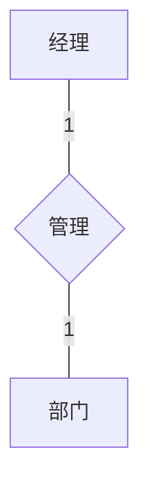
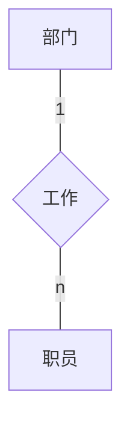
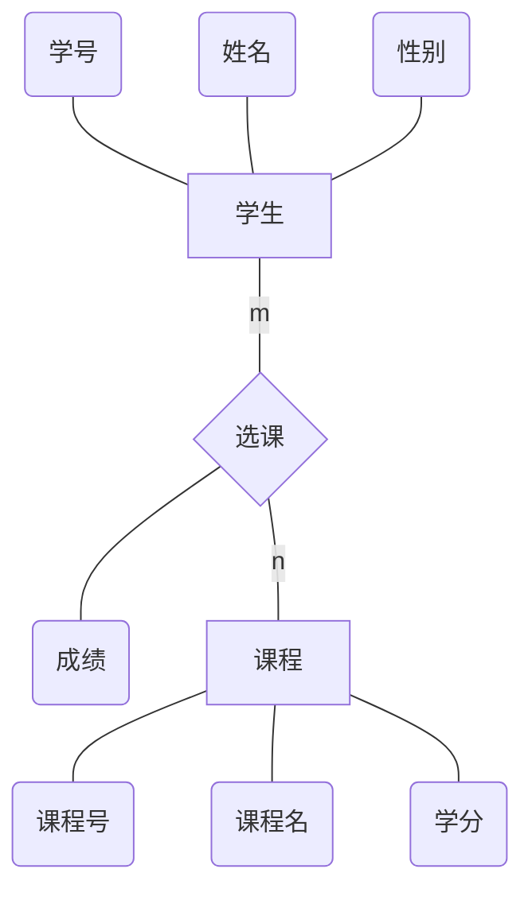
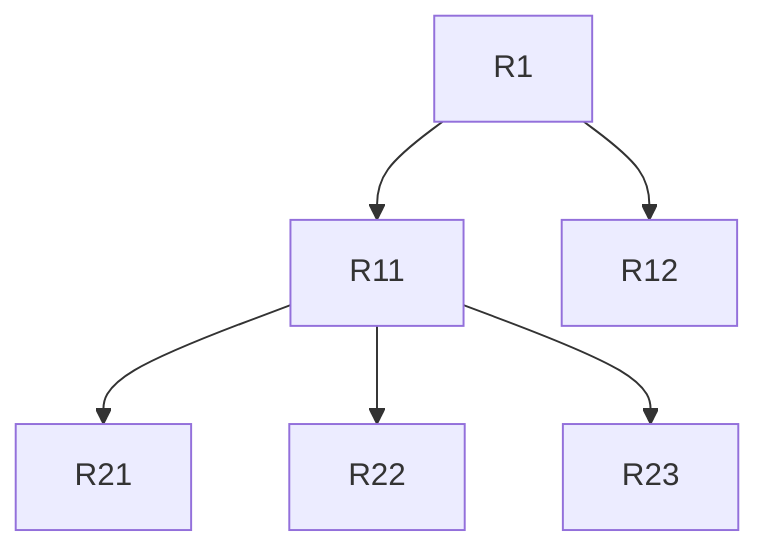
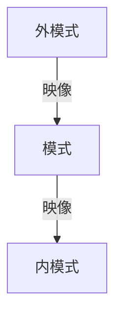

# 数据库

## 第一章--数据库概述

### 概念

数据（Data），描述事物的符号标记

数据库（DB），存放数据的仓库，具有**永久存储、有组织和可共享**三个基本特点

数据库管理系统（DBMS），位于用户应用程序与操作系统之间，专门用于实现对数据进行管理和维护的系统软件

数据库系统（DBS）,指在计算机中引入数据库后的系统，一般由**数据库、数据库管理系统、应用程序、数据库管理员**组成，为不引起混淆书中一般把DBS称为数据库

### 数据库的诞生

就是最早是用文件管理系统进行管理数据，然后很不方便，巴拉巴拉巴拉。。。

而有了数据库后，用户只需要知道存放所需数据的数据库名，就可以对数据库对应的数据文件中的数据进行操作。

具有如下好处：

- 相互关联的数据集合
- 较少的数据冗余
- **程序与数据相互独立**
- 保证数据安全可靠
- 最大限度地保证数据的正确性
- 数据可以共享并能保证数据的一致性

### 数据独立性

**数据独立性**包括数据的**物理独立性**和数据的**逻辑独立性**

**物理独立性**是指用户的应用程序与存储在磁盘上的数据库中数据是相互独立的。

**逻辑独立性**是指用户的应用程序与数据库的逻辑结构是相互独立的，即，当数据的逻辑结构改变时，用户程序也可以不变。

其实有个问题就是**三级模式**[^1]，外模式、模式、内模式

### 数据库系统

- 硬件 
- 软件
  - 数据库管理系统
  - 支持数据库管理系统运行的操作系统，比如Windows、Linux
  - 以数据库管理系统为核心的使用工具
- 人员
  - 数据库管理员，负责维护整个系统的政策运行，负责保障数据库的安全与可靠
  - 系统分析员。负责应用系统的需求分析和规范说明，参与数据库应用系统的概要设计
  - 数据库设计人员 ，确定数据库数据，设计数据库的结构，一般由数据库管理员兼任

## 第二章--数据模型与数据库结构

### 数据库特征

- 静态特征
  - 包括数据的基本结构、数据间的关系以及对数据取值范围的约束
- 动态特征
  - 指对数据可以进行的操作以及操作规则。（增删查改）

数据模型三要素：描述数据时要包括数据的基本结构、数据的约束条件（**前两个是静态特征**）和定义在数据上的操作（**动态特征**）

### 数据模型

数据模型是一种模型，他是对现实世界数据特征的抽象

### 概念层（E-R图）

- 实体
  - 具有公共性质，并可相互区分的显示世界对象的集合（比如说职工、学生、课程）
  - 实体中每个具体的记录值（一行数据），称为实体的一个实例，比如：学生实体中的一个具体学生就是学生实体的一个实例
  - **用矩形框表示**
- 属性
  - 每个实体都具有一定的特征或性质，**属性是描述实体或联系的性质或特征的数据项，属于一个实体的所有实例都有相同的性质**，例如学生的学号、姓名、出生日期
  - 在实体属性中，能够唯一标识实体的一个属性或最小的一组属性称为**实体的标识属性**
  - **用圆角矩形表示**
- 联系
  - **用菱形框表示**，用连线将联系框与他所关联的实体连接起来
  - 联系也可以有自己的属性

两个实体的联系之间往往有以下三类：

- 一对一：

- 一对多：

- 多对多：

### 组织层数据模型

#### 层次数据模型

用树状结构表示实体与实体之间的联系，层次模型可以直接方便地表示一对多的关系，但有如下限制：

- 有且仅有一个节点无父节点，这个节点即为树的根
- 其他节点有且仅有一个父节点

模型示意图：

#### 网状数据模型

用网形结构表示实体与实体之间的联系的数据模型

#### 关系数据模型（最常用）

用关系（表格数据）表示实体与实体之间的联系的数据模型，与前面模型相比最根本的区别是：**关系数据模型采用非导航式的数据访问方式，数据结构的变化不会影响对数据的访问**

模型示意图：

| 学号 | 课程号 | 成绩 |
| :--: | :----: | :--: |
| 001  |  C003  |  33  |
| 002  |  C002  |  23  |
| 003  |  C005  |  13  |

### 数据库架构---三级模式架构

- **模式**
  - 是数据库中全体数据的逻辑结构和特征的描述，它仅仅涉及到“型”的描述，不涉及具体的值
  - 模式的一个具体值称为模式的一个事例
  - 数据模式描述一类事物的结构、属性、类型和约束，实质上是用数据模型对一类事物进行模拟，而事例是反映某类事物在某一时刻的当前状态
  - 描绘着一个部门或公司的全体数据
  - 只有一个
- **外模式**
  - 是面向用户的数据需求视图
  - 模式的子集
  - 可以有很多个
- **内模式**
  - 是整个数据库的底层表示
  - 只有一个

### 模式映像

1. 外模式/模式映像

   模式描述的是全局的逻辑结构，外模式描述的是数据的局部逻辑结构

2. 模式/内模式映像

   定义了数据库的逻辑结构与物理存储之间的对应关系

## 第三章--关系数据库

关系模型三要素：关系模型的数据结构、关系模型的操作集合、关系模型的完整约束性

### 关系数据模型

- 数据结构：表
- **数据操作——操作的是表**
  - 并交差乘
  - 选择、投射、连接、除
  - 查询、插入、删除、更改
- 数据完整性约束
  - 与现实世界中应用需求的数据的相容性和正确性
  - 数据库内数据的相容性和正确性

### 基本术语

- 关系

- 属性

- 值域

- 元组：二维表的一行数据称为一个元组

- 分量：元组中的每一个属性值称为元组的一个分量

- 关系模式：二维表的结构称为关系模式

  设有关系名$R$，属性分别为${A_1,A_2,...,A_n}$，则关系模式表示为：$R({A_1,A_2,...,A_n})$

  每个$A_i(i=1,...,n)$还包括该属性到值域的映射，及属性的取值范围

  例如：学生（学号，姓名，年龄，性别，所在系）

- 关系数据库：对应于一个关系模型所有关系的集合

- 候选键：如果一个属性或属性集的值能够唯一标识一个关系的元组而有不包含多余的属性，则这个属性或属性集为候选键

  例如：学生（学号，姓名，年龄，性别，所在系）的候选键为学号

- **主键:当一个关系中有多个候选键，可以从中选一个做主键**

- 主属性和非主属性：包含在任意候选键的属性称为主属性，不包含在任意候选键的属性称为非主属性

### 形式化定义

1. 关系的形式化定义

   设$D_1,D_2,...,D_n$为任意集合，定义笛卡尔积$D_1,D_2,...,D_n$为：

   ​	$${D_1\times D_2\times ...\times D_n=\{(d_1,d_2,...,d_n)|d_i\in D_i,i=1,2,...,n\}}$$

   其中每一个元素$(d_1,d_2,...,d_n)$称为一个$n$元组，简称元组。元组中的每一个$d_i$称为一个变量

   例如：

   

------

[^1]:https://blog.csdn.net/ttzax2015/article/details/81058251)

